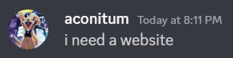

# Plan

> building a personal website for Acon

- [ ] design website layout on Figma
- [ ] create files (html + css)
- [ ] initialize Git repo
- [ ] add styling
- [ ] add custom font
- [ ] make sure website is responsive

## Sections

- [ ] landing
  - [ ] navbar
  - [ ] name
  - [ ] social links
  - [ ] image
- [ ] about
  - [ ] add about text
- [ ] projects
  - [ ] project:
    - [ ] image
    - [ ] name
    - [ ] short description
- [ ] contact / footer
  - [ ] social links
